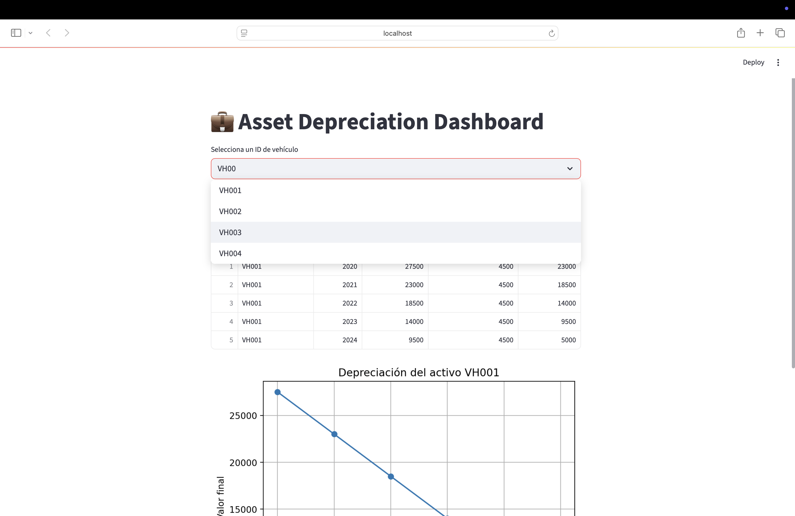
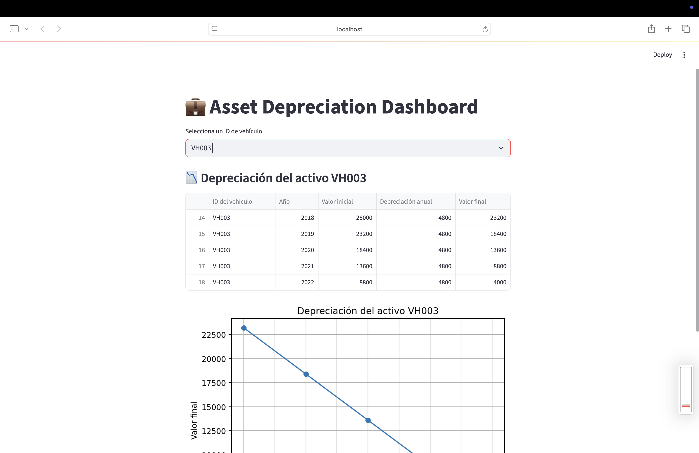

# 💼 Asset Depreciation Dashboard

This project is developed for a **finance company based in Peru**.  
It uses **theoretical (simulated) asset data** to demonstrate how businesses can visualize and manage asset depreciation over time using a simple dashboard.

---

## 📦 Features

- Upload and analyze asset data (CSV)
- Automatically calculate yearly depreciation
- Visualize data using interactive line graphs
- Filter by asset ID for detailed views
- Lightweight and runs locally with Streamlit

---

## 🚀 Getting Started

### 1. Clone the repository

```bash
git clone https://github.com/Alonbbar6/zoilas_project.git
cd zoilas_project


# Set up a virtual environment
python3 -m venv venv
source venv/bin/activate  # On Windows: venv\Scripts\activate

#Install dependencies

pip install -r requirements.txt


#run the app
streamlit run app.py

## 💡 Note on Virtual Environment
To avoid dependency issues, we recommend running this project in a Python virtual environment.

## 🖼️ Sample Screenshots

Here are some sample dashboards based on different vehicles:

### VH001 Dashboard


### VH002 Dashboard
